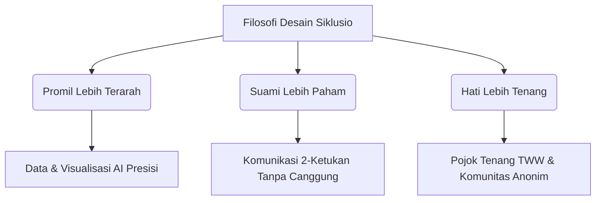

# 🎨 Siklusio v2 — Design System & UI/UX Specification

Selamat datang di Panduan Sistem Desain (Design System) resmi **Siklusio v2**. Dokumen ini dirancang sebagai acuan tunggal (_single source of truth_) bagi pengembang dan desainer untuk membangun, memperluas, dan memelihara antarmuka pengguna (UI) serta pengalaman pengguna (UX) Siklusio di seluruh platform (Android, iOS, dan Web).

Siklusio memadukan **Keakuratan Medis/AI** dengan **Kehangatan Emosional**, menciptakan ruang digital yang aman, ramah, dan bebas dari penghakiman bagi pejuang garis dua di Indonesia.

---

## 1. Filosofi & Pilar Desain

Desain Siklusio dibangun di atas tiga pilar utama yang diturunkan langsung dari positioning utama kita:

> _“Promil lebih terarah, suami lebih paham, hati lebih tenang.”_



### 🌸 Tiga Pilar Utama:

1. **Promil Lebih Terarah (Precision & Clarity):**
   Visualisasi data medis (seperti grafik kalender, fase siklus aktif, dan ringkasan AI) harus disajikan dengan sangat jelas, terstruktur, dan mudah dipahami dalam hitungan detik. Hindari istilah klinis yang menakutkan; gunakan penyederhanaan visual.
2. **Suami Lebih Paham (Empathy & Connection):**
   Antarmuka untuk melibatkan pasangan dirancang dengan hambatan interaksi serendah mungkin (_frictionless_). Penggunaan template pesan satu tombol (WhatsApp) menghilangkan rasa canggung komunikasi antar-pasangan.
3. **Hati Lebih Tenang (Calm & Sanctuary):**
   Untuk mengurangi stres selama fase menunggu dua minggu (_Two-Week Wait_), antarmuka menggunakan transisi yang sangat halus, warna-warna lembut (teal & pink pastel), ilustrasi yang menenangkan, serta micro-animations pernapasan yang memandu relaksasi secara dinamis.

---

## 2. Sistem Warna (Color & Semantic Tokens)

Siklusio menggunakan palet warna yang feminin, modern, dan menyejukkan. Warna-warna ini dikonfigurasi secara modular di dalam `tailwind.config.js` menggunakan sistem penamaan semantik Material Design 3 (MD3).

### 🎨 Palet Warna Inti:

| Token Semantik       | Warna Hex | Representasi Visual & Peran Utama                                                           |
| :------------------- | :-------- | :------------------------------------------------------------------------------------------ |
| `primary`            | `#ec4899` | **Magenta Utama:** Tombol CTA utama, ikon aktif, fase menstruasi.                           |
| `on-primary`         | `#ffffff` | **Teks Kontras Utama:** Digunakan di atas warna `primary`.                                  |
| `secondary`          | `#ccfbf1` | **Teal Lembut (Masa Subur):** Latar belakang notifikasi masa subur, _active states_ promil. |
| `on-secondary`       | `#0f766e` | **Teal Gelap Kontras:** Teks di atas warna `secondary`.                                     |
| `tertiary`           | `#14b8a6` | **Toska Utama:** Tombol tabungan, fase ovulasi, aksi sukses.                                |
| `on-tertiary`        | `#ffffff` | **Teks Kontras Tersier:** Teks di atas warna `tertiary`.                                    |
| `background`         | `#fdf2f8` | **Pink 50 (Latar Aplikasi):** Warna dasar kanvas aplikasi mobile & web.                     |
| `on-background`      | `#4a044e` | **Fuchsia 900:** Judul utama halaman dan teks navigasi aktif.                               |
| `surface`            | `#ffffff` | **Putih Murni:** Kartu info, modal, pop-up, background input form.                          |
| `on-surface`         | `#701a75` | **Fuchsia 800:** Teks utama di atas kartu permukaan (`surface`).                            |
| `surface-variant`    | `#fce7f3` | **Pink 100:** Kontainer sekunder, chat bubble pengguna, outline ringan.                     |
| `on-surface-variant` | `#831843` | **Pink 900:** Deskripsi kartu sekunder, label formulir.                                     |
| `outline-variant`    | `#fbcfe8` | **Pink 200:** Pembatas horizontal (border), visual pemisah antar section.                   |
| `error`              | `#e11d48` | **Rose 600:** Pesan eror, batas waktu habis, penanda laporan moderasi.                      |

### ✨ Pola Gradasi (Gradients):

- **Gradient Primary (Brand Signature):**
  `linear-gradient(to right, #ec4899, #db2777)` — Digunakan untuk tombol utama "Log Haid", "Kirim", dan visual utama brand.
- **Gradient Background Glassmorphism (Aesthetic Blend):**
  Kombinasi latar belakang yang sangat halus dari kiri atas ke kanan bawah:
  `Pink 50 (#fdf2f8) ──> Violet 50 (#faf5ff) ──> Teal 50 (#f0fdfa)`
- **Gradient TWW Sanctuary (Calm Aura):**
  `linear-gradient(to bottom, #fdf2f8, #e0f2fe)` (Pink lembut ke biru langit ultra-tipis) — Memancarkan aura ketenangan visual saat cemas.

---

## 3. Tipografi & Skala Teks (Typography)

Siklusio mengadopsi dua jenis huruf dari Google Fonts untuk membedakan struktur hierarki dengan tegas:

### 🖋️ Karakteristik Huruf:

1.  **Heading Font: Outfit**
    - _Sifat:_ Bulat (_rounded_), ramah, geometris, modern.
    - _Penggunaan:_ Judul Halaman (H1, H2), Angka Statistik (Hari Haid, Jumlah Tabungan), nama brand.
2.  **Body Font: Plus Jakarta Sans**
    - _Sifat:_ Sangat bersih (_clean_), tingkat keterbacaan tinggi pada layar kecil, modern sans-serif.
    - _Penggunaan:_ Teks paragraf, deskripsi form, input field, pesan komunitas, dan panduan harian AI.

### 📏 Skala & Aturan Hierarki Teks:

| Kelas / Token  | Ukuran (px/rem)   | Weight            | Line Height | Contoh Penggunaan                      |
| :------------- | :---------------- | :---------------- | :---------- | :------------------------------------- |
| `Display / H1` | `30px (1.875rem)` | `800 (ExtraBold)` | `1.2`       | Nama Brand, Angka Hari Haid            |
| `Title / H2`   | `20px (1.25rem)`  | `700 (Bold)`      | `1.3`       | Judul Kartu Dashboard, Nama Menu       |
| `Sub-title`    | `16px (1.0rem)`   | `600 (SemiBold)`  | `1.4`       | Sub-judul kartu, Teks tombol utama     |
| `Body Large`   | `15px (0.938rem)` | `400 (Regular)`   | `1.5`       | Konten posting komunitas, Jurnal       |
| `Body Medium`  | `13px (0.813rem)` | `500 (Medium)`    | `1.5`       | Panduan AI harian, label input form    |
| `Caption`      | `11px (0.688rem)` | `700 (Bold)`      | `1.3`       | Penanda siklus (e.g. SIKLUS HARI KE-N) |

---

## 4. Layout, Spacing, & Border Radius

Siklusio mengikuti standar grid modular **4px** untuk menjaga konsistensi jarak antar elemen di seluruh platform.

### 📐 Aturan Spacing (Padding & Margin):

- `px-[8px]` (2) / `px-[12px]` (3): Margin mikro untuk tombol kecil, badge reaksi, atau chip.
- `p-[16px]` (4): Padding standar untuk kartu kecil, list item, dan input text.
- `p-[24px]` (6): Padding untuk kartu utama dashboard (e.g. `CycleCard`) dan kontainer modal dialog.
- `gap-[32px]` (8): Batas pemisah vertikal antar section utama di dashboard.

### 🌀 Aturan Border Radius (Sudut Tumpul):

Untuk menciptakan kesan yang lembut, hangat, dan feminin, Siklusio melarang sudut tajam (90 derajat):

```
[  8px  ] -> Rounded Small (Badge, Kapsul Emoji)
[ 16px  ] -> Rounded Medium (Tombol Utama, Text Input, PostCard)
[ 24px  ] -> Rounded Large (Modal Dialog, ActionCard)
[ 32px  ] -> Rounded Extra Large (CycleCard Dashboard)
[ 9999px] -> Rounded Full (Latihan Pernapasan, Avatar Bulat)
```

> [!IMPORTANT]
> **Aturan Bayangan (Shadows):**
> Siklusio menghindari penggunaan bayangan hitam pekat (`#000000`). Sebagai gantinya, gunakan bayangan berwarna transparan (_colored shadow_) yang disesuaikan dengan warna aksen elemen tersebut. Contoh: Tombol Pink menggunakan `rgba(236, 72, 153, 0.2)` untuk memberikan efek menyala (_glow_) yang lembut dan premium.

---

## 5. Pola UX & Interaksi Spesifik

Siklusio memiliki beberapa pola interaksi unik yang dirancang khusus untuk membangun kedekatan emosional pengguna:

### 🗺️ Alur Onboarding Terpandu (8-Langkah):

- Setiap langkah onboarding hanya berfokus pada **satu pertanyaan** untuk meminimalkan beban kognitif pengguna.
- Gunakan indikator progres visual di bagian atas berupa garis transparan pink untuk menunjukkan posisi langkah pengguna saat ini.
- Navigasi tombol menggunakan transisi geser horizontal (_horizontal slide_) untuk memperkuat kesan petualangan terpandu.

### ⭕ Lingkaran Gauge Dashboard (Cycle Card):

- Pusat visual dari halaman beranda adalah **Circular Cycle Card**.
- Warna lingkaran dinamis berubah menyesuaikan kondisi kesuburan Bunda:
  - _Merah Transparan (`border-primary/30`):_ Fase Haid.
  - _Teal Cerah (`border-secondary`):_ Masa Subur / Puncak Ovulasi.
  - _Violet/Pink Tipis (`border-primary/10`):_ Fase Folikular & Luteal biasa.
- Tombol log aksi cepat selalu diposisikan tepat di bawah gauge lingkaran agar mudah dijangkau oleh satu ibu jari saat menggenggam ponsel.

```
       +-----------------------------------+
       |          Fase Masa Subur          |
       |               [🌸]                |
       |                                   |
       |            /---------\            |
       |           /           \           |
       |          |   5 Hari   |           |
       |          |  Lagi Haid |           |
       |           \           /           |
       |            \---------/            |
       |                                   |
       |        SIKLUS HARI KE-14          |
       +-----------------------------------+
```

### 🧘‍♀️ Alur Interaksi Pojok Tenang TWW (TWW Sanctuary):

Fase dua minggu penantian (TWW) sangat rawan kecemasan. UI di bagian ini dirancang khusus untuk memperlambat detak jantung pengguna melalui visual:

1.  **Ambient Mood Selector:** 4 tombol bundar besar dengan ikon cantik (🍃, 🧘‍♀️, ☕, ✨) yang langsung mengaktifkan trek audio latar belakang yang menenangkan saat diketuk.
2.  **Visualizer Pernapasan:** Lingkaran bernyawa yang membesar selama 4 detik (Tarik Napas), menahan selama 4 detik, dan mengecil selama 4 detik (Hembuskan Napas). Didukung teks panduan dinamis di tengahnya.
3.  **Surat Tenang AI (Sequential Fade & Auto-Scroll):**
    - Surat dari AI tidak langsung muncul secara masif. Respons dibagi menjadi beberapa bagian terstruktur: `title`, `opening`, `validation`, `grounding`, `affirmation`, `breathingTip`, dan `closing`.
    - Setiap paragraf muncul bergantian menggunakan transisi _fade-in_ (0 ke 1) dan _slide-up_ (10px ke 0) berdurasi 800ms per bagian.
    - Layar secara otomatis melakukan _scroll_ ke bawah secara perlahan seiring munculnya teks baru, memberikan efek membaca yang tenang dan membimbing mata Bunda. Auto-scroll langsung dijeda secara otomatis jika pengguna menyentuh layar secara fisik.

---

## 6. Kode Resep Komponen (Style Recipes)

Berikut adalah contoh resep kode UI menggunakan komponen fungsional React Native yang digabungkan dengan kegunaan kelas NativeWind (Tailwind CSS) untuk menjamin konsistensi implementasi desain:

### 📦 1. Base Container Card (Standard Card)

Kartu dasar yang digunakan untuk membungkus konten seperti Affirmation Card atau tips harian.

```tsx
import React from "react";
import { View } from "react-native";

export function BaseCard({ children }: { children: React.ReactNode }) {
  return (
    <View className="w-full bg-surface rounded-[24px] p-[20px] border border-outline-variant shadow-sm shadow-pink-100/50">
      {children}
    </View>
  );
}
```

### ⚡ 2. Action Card (CTA Adaptif Dashboard)

Kartu interaktif di Dashboard yang secara dinamis mengajak Bunda melakukan tindakan tertentu berdasarkan fasenya.

```tsx
import React from "react";
import { View, Text, TouchableOpacity } from "react-native";

interface ActionCardProps {
  title: string;
  description: string;
  badgeText: string;
  icon: string;
  onPress: () => void;
}

export function ActionCard({ title, description, badgeText, icon, onPress }: ActionCardProps) {
  return (
    <TouchableOpacity
      activeOpacity={0.8}
      onPress={onPress}
      className="w-full bg-surface rounded-[24px] p-[20px] border border-outline-variant flex-row gap-[16px] items-center shadow-sm shadow-pink-100/40"
    >
      <View className="w-[56px] h-[56px] bg-background rounded-full items-center justify-center border border-outline-variant/50">
        <Text className="text-3xl">{icon}</Text>
      </View>
      <View className="flex-1">
        <View className="bg-pink-100/60 self-start px-[10px] py-[2px] rounded-full border border-pink-200/50 mb-[6px]">
          <Text className="text-[10px] font-bold text-primary uppercase tracking-wider">
            {badgeText}
          </Text>
        </View>
        <Text className="text-md font-bold text-on-background leading-tight mb-[4px]">{title}</Text>
        <Text className="text-xs text-slate-600 leading-normal">{description}</Text>
      </View>
    </TouchableOpacity>
  );
}
```

### 🌸 3. Premium Button (Primary Gradient)

Tombol utama yang memberikan penekanan visual terbaik pada layar pendaftaran, konfirmasi, atau pembelian.

```tsx
import React from "react";
import { Text, TouchableOpacity } from "react-native";
import { LinearGradient } from "expo-linear-gradient";

export function PremiumButton({ title, onPress }: { title: string; onPress: () => void }) {
  return (
    <TouchableOpacity
      activeOpacity={0.9}
      onPress={onPress}
      className="w-full rounded-[16px] overflow-hidden shadow-md shadow-pink-500/20 active:scale-[0.98] transition-transform"
    >
      <LinearGradient
        colors={["#ec4899", "#db2777"]}
        start={{ x: 0, y: 0 }}
        end={{ x: 1, y: 0 }}
        className="px-[24px] py-[16px] items-center justify-center"
      >
        <Text className="text-white font-bold text-md tracking-wide">{title}</Text>
      </LinearGradient>
    </TouchableOpacity>
  );
}
```

---

## 7. Responsivitas & Universal Web Shell (+html.tsx)

Siklusio adalah aplikasi universal yang berjalan di ponsel maupun peramban web. Untuk memberikan pengalaman premium bagi pengguna desktop yang membuka aplikasi web, Siklusio menggunakan teknik pembungkus bingkai ponsel simulasi (_phone mock frame_):

```
             KOMPUTER / DESKTOP SCREEN (Web)
+-------------------------------------------------------+
|  SIKLUSIO BRAND BG   +-----------------+              |
|                      |  [o]   PHONE    |              |
|  * Sahabat Terbaik   | +-------------+ |              |
|    Setiap Fase       | |             | |              |
|    Kewanitaanmu.     | |  SIKLUSIO   | |              |
|                      | |  APP AREA   | |              |
|  * Promil Terarah    | |  (Responsive| |              |
|                      | |   View)     | |              |
|                      | +-------------+ |              |
|                      +-----------------+              |
+-------------------------------------------------------+
```

### 📱 Desain Phone Frame Desktop Web:

- Jika diakses lewat komputer (lebar layar `> 768px`), halaman web akan merender kontainer utama aplikasi di tengah-tengah layar dengan lebar tetap sebesar **390px** dan rasio aspek **19.5:9** (mirip dimensi iPhone modern).
- Latar belakang komputer di luar bingkai ponsel akan menampilkan gradasi warna merek yang berputar secara dinamis dipadukan dengan logo bunga floral Siklusio berukuran besar untuk mempertahankan keindahan visual yang memukau (_stunning first impression_).
- Pada platform web mobile asli atau aplikasi native Android/iOS, bingkai ini otomatis menghilang dan konten langsung merenggang memenuhi 100% ukuran layar fisik pengguna.

---

## 8. Panduan Desain Gerak & Mikro-Animasi

Animasi di Siklusio bukan hanya pemanis, melainkan alat penenang emosi dan penunjuk arah interaksi:

### 🏃‍♂️ Parameter Durasi & Kecepatan:

- **Transisi Layar:** `350ms` menggunakan kurva `ease-out` untuk transisi navigasi antar halaman.
- **Interaksi Tombol (Press State):** `150ms` `scale-[0.97]` saat ditekan untuk memberikan umpan balik taktil yang nyata pada jari pengguna.
- **Hover State (Web-only):** `200ms` dengan pergeseran warna bayangan yang memudar halus saat didekatkan kursor.
- **Latihan Napas (Breathing Pulse):** `4000ms` membesar (tarik napas) ──> `4000ms` diam ──> `4000ms` mengecil (hembuskan napas) menggunakan interpolasi kurva sinusoida (`bezier(0.445, 0.05, 0.55, 0.95)`).

### 💀 Skeleton Screen (Pemuatan Cerdas):

- Siklusio melarang penggunaan pemutar _loading spinner_ abu-abu bawaan browser yang membosankan saat memuat data komunitas atau AI.
- Gunakan kartu placeholder abu-abu/pink sangat muda yang memancarkan cahaya redup berpindah-pindah (_shimmering effect_ / denyut opasitas `animate-pulse` antara 0.3 dan 0.7) untuk memberikan persepsi pemuatan data yang lebih cepat dan modern.

---

## 9. Desain Aksesibilitas (a11y) & SEO

Untuk memastikan Siklusio ramah bagi semua kalangan, termasuk ibu hamil yang mungkin mengalami penurunan sensitivitas pandangan mata sementara:

1.  **Kontras Teks Tinggi:**
    Setiap teks informatif dilarang keras menggunakan warna abu-abu tipis di atas warna latar putih. Kontras teks minimal wajib berada pada rasio **4.5:1** (sesuai standar WCAG AA). Gunakan slate-800 (`#1e293b`) sebagai standar warna teks gelap.
2.  **Identitas Unik Elemen UI:**
    Setiap tombol penting (e.g. login, posting, ajak suami) wajib memiliki properti `id` unik yang deskriptif guna mempermudah pembaca layar (_screen reader_) tunanetra dan pengujian otomatis browser.
3.  **Heading Semantik (SEO Web):**
    Pada halaman landas web (`index.html` & `checkout.html`), struktur penamaan tag wajib berurutan secara hierarkis: hanya ada satu `<h1>` utama di paling atas, diikuti oleh `<h2>` untuk bagian fitur, dan `<h3>` untuk kartu detail promil.

---

_Panduan Desain Siklusio v2 dibuat dengan dedikasi tinggi agar setiap sentuhan di aplikasi terasa hangat dan memberikan ketenangan hati bagi setiap Bunda di Indonesia. 🌸_
