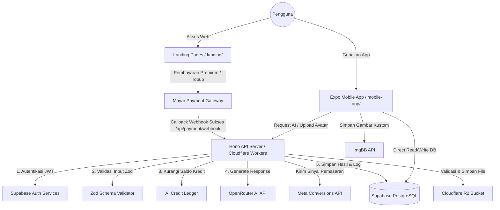

# Siklusio v2 Architecture Guide

Last updated: 2026-06-05  
Last verified against codebase: 2026-06-05 (Developer onboarding snapshot after Phase 31 backend decomposition and mobile features reorganization)  
Target Audience: Non-coder Founder & AI Coding Agents

---

## 1. Executive Summary (For the Founder)

Siklusio v2 dibangun dengan arsitektur **Monorepo** (satu repositori untuk seluruh komponen sistem). Struktur ini memisahkan aplikasi menjadi tiga bagian utama yang bekerja bersama secara real-time:

1. **Frontend Landing Page (`landing/`)**: Halaman web publik tempat calon pengguna membaca informasi produk dan melakukan pembelian premium.
2. **Mobile Application (`mobile-app/`)**: Aplikasi utama yang diinstal di ponsel pengguna (iOS/Android) untuk melacak siklus, kebiasaan (_habits_), berinteraksi di komunitas anonim, dan berkonsultasi dengan pendamping emosional berbasis AI.
3. **Backend API Server (`backend/`)**: Otak pemroses yang berjalan cepat di server Cloudflare Workers. Bagian ini menangani perhitungan berat, verifikasi pembayaran melalui webhook `/api/payment/webhook`, pembatasan akses (_rate-limiting_), dan pemrosesan kecerdasan buatan (AI) secara aman tanpa membebani baterai ponsel pengguna.

Semua komponen di atas dihubungkan secara terpusat oleh **Supabase** yang mengelola autentikasi pengguna dan database PostgreSQL secara aman menggunakan kebijakan Row Level Security (RLS).

---

## 2. System Flow Diagram (Mermaid)

Diagram di bawah ini menggambarkan alur komunikasi antarkomponen saat pengguna mengakses aplikasi, melakukan transaksi, dan meminta analisis AI:



---

## 3. Monorepo Boundary & Directory Map

Repositori Siklusio v2 didekomposisi secara ketat untuk menjaga kerapian kode dan mempermudah AI Agent melakukan modifikasi tanpa merusak fitur lainnya.

| Direktori                      | Tanggung Jawab (Responsibility)                                     | Kontrak Batasan (Boundary Contract)                                                                                                              |
| ------------------------------ | ------------------------------------------------------------------- | ------------------------------------------------------------------------------------------------------------------------------------------------ |
| **`landing/`**                 | Landing Page statis & Form Checkout.                                | Berisi file HTML/CSS murni. Tidak boleh mengandung logika TypeScript backend atau dependensi Node berat.                                         |
| **`mobile-app/app/`**          | Route Entrypoint untuk Expo Router.                                 | **Hanya** berfungsi sebagai berkas _wrapper_ navigasi tipis. Tidak boleh ada implementasi komponen visual atau logika bisnis yang rumit di sini. |
| **`mobile-app/src/features/`** | Fitur Utama Mobile (Calendar, Habits, Community, Dashboard, Admin). | Tempat berkumpulnya komponen layar (_screens_), UI khusus, dan hooks pendukung fitur.                                                            |
| **`mobile-app/src/shared/`**   | Komponen UI dan Utilitas global yang dipakai bersama ( reusable ).  | Menyediakan UI fundamental (avatar picker, date field, credit chip) dan fungsi pembantu umum.                                                    |
| **`backend/index.ts`**         | Entrypoint compat wrapper.                                          | Melakukan export dari backend source.                                                                                                            |
| **`backend/src/`**             | Sumber Utama Kode Server Hono.                                      | Seluruh endpoint, middleware, controller, dan schemas didefinisikan di sini. Entrypoint Wrangler diarahkan langsung ke `backend/src/index.ts`.   |
| **`backend/src/routes/`**      | Layer Rute API.                                                     | Menangani mapping route untuk API Hono.                                                                                                          |
| **`backend/src/services/`**    | Layer Layanan Bisnis.                                               | Layanan eksternal seperti integrasi Mayar dan Meta CAPI.                                                                                         |
| **`supabase/migrations/`**     | Sumber Kebenaran Tunggal (_Source of Truth_) Skema Database.        | Seluruh perubahan DDL database wajib melalui file migrasi di folder ini. SQL di folder root hanyalah referensi legacy.                           |

---

## 4. Backend Request Execution Lifecycle

Setiap permintaan (_request_) HTTP yang masuk ke backend Hono akan melewati rangkaian tahapan terstruktur berikut:

```text
HTTP Request (misal: POST /api/cycle-guide/generate)
   │
   ├──▶ 1. MIDDLEWARE: CORS (`cors.ts`)
   │      Memvalidasi apakah origin request berasal dari domain tepercaya (app.siklusio.web.id).
   │
   ├──▶ 2. MIDDLEWARE: Rate Limit (`rateLimit.ts`)
   │      Memastikan request IP/user ID tidak melebihi ambang batas keamanan yang ditentukan.
   │
   ├──▶ 3. ROUTE MATCHING (`routes/ai.cycleGuide.route.ts`)
   │      Mengarahkan request ke Controller yang sesuai berdasarkan path dan method HTTP.
   │
   ├──▶ 4. CONTROLLER AUTH CHECK (`controllers/ai.cycleGuide.controller.ts`)
   │      Memanggil `requireUser(c)` untuk memverifikasi JWT token dari header Authorization.
   │
   ├──▶ 5. CONTROLLER INPUT VALIDATION (`schemas/requestSchemas.ts`)
   │      Menggunakan skema Zod untuk memvalidasi format data input (misal: `generatedForDate`).
   │
   ├──▶ 6. SERVICE CALL (`services/aiCreditLedger.ts`)
   │      Memeriksa kecukupan saldo kredit AI user di database Supabase.
   │
   ├──▶ 7. EXTERNAL API CALL (`ai/openRouter.ts`)
   │      Mengirim instruksi prompt terproteksi ke OpenRouter AI.
   │
   └──▶ 8. DATABASE TRANSACTION & RESPONSE
          Memotong kredit, menyimpan hasil analisis ke database, dan mengembalikan JSON ke klien.
```

---

## 5. Hubungan Antar Modul Utama (Load-Bearing Abstractions)

Menurut analisis dependensi kode (_Graphify_), komponen-komponen berikut adalah pondasi dasar yang menopang logika Siklusio:

- **`CycleContext` / `useCycle()`**: Menghitung dan menyebarkan status fase haid saat ini (Menstruasi, Folikular, Ovulasi, Luteal) ke seluruh layar aplikasi mobile.
- **`AuthContext` / `useAuth()`**: Mengelola sesi masuk pengguna, sinkronisasi token, dan mendeteksi apakah pengguna berstatus admin atau member biasa.
- **`SyncManager`**: Memastikan data log harian yang dicatat secara offline disinkronkan secara atomik ke database remote Supabase saat internet terhubung kembali.
- **`dateUtils`**: Utilitas untuk manipulasi tanggal lokal yang seragam di frontend, mobile-app, dan backend guna menghindari bug pergeseran zona waktu (timezone shift).
