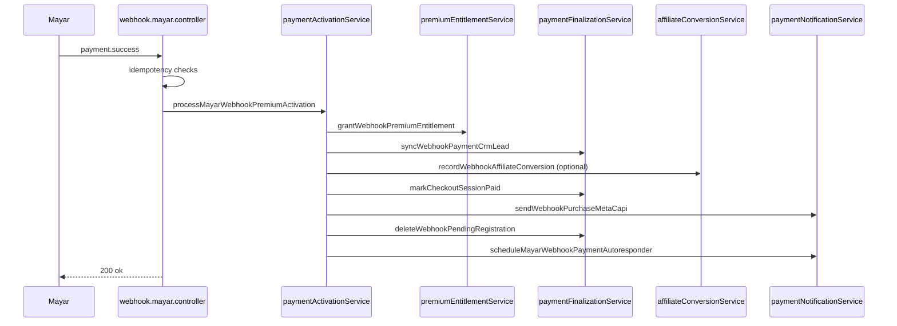
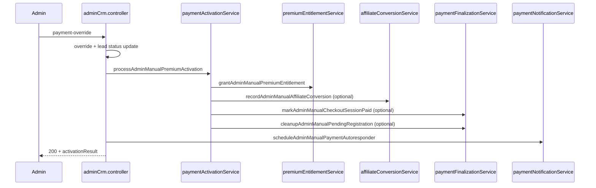

# Payment Flow Architecture

Last updated: 2026-06-09  
Introduced after Sprint 2G (coordinator + specialized services refactor)  
Target audience: AI coding agents and backend maintainers

This document locks the post-refactor payment architecture. **Do not re-inline implementation details into `paymentActivationService.ts`.** Extend or fix behavior in the specialized service that owns the concern.

Related docs: [API.md](./API.md), [SECURITY.md](./SECURITY.md), [TESTING.md](./TESTING.md), [ARCHITECTURE.md](./ARCHITECTURE.md)

---

## 1. Payment flow overview

Premium lifetime payment activation is split across:

| Layer | Responsibility |
|-------|----------------|
| **Route controllers** | HTTP routing, token/auth guards, idempotency at webhook boundary, response status codes |
| **`paymentActivationService`** | **Coordinator only** — owns call sequence, shared snapshot types, `AdminManualActivationResult` |
| **Specialized services** | Entitlement, affiliate, notification, finalization |

```text
Mayar webhook / Admin CRM override
        │
        ▼
paymentActivationService (coordinator)
        │
        ├── premiumEntitlementService      (auth + credits)
        ├── paymentFinalizationService     (session paid, pending cleanup, CRM sync)
        ├── affiliateConversionService     (commission + conversions)
        └── paymentNotificationService     (Meta CAPI + WhatsApp)
```

Entry points (routing — **do not move business sequence into controllers**):

- Webhook: `backend/src/controllers/webhook.mayar.controller.ts` → `processMayarWebhookPremiumActivation`
- Admin manual: `backend/src/controllers/adminCrm.controller.ts` → `processAdminManualPremiumActivation`

Checkout registration (pre-payment) remains in `checkoutRegistrationService.ts` and is **out of scope** for this coordinator.

---

## 2. Webhook Mayar happy path

**Endpoint:** `POST /api/payment/webhook`  
**Controller:** `webhook.mayar.controller.ts`

### Controller pre-checks (before coordinator)

1. Validate `X-Callback-Token` against `MAYAR_WEBHOOK_TOKEN`.
2. Resolve `checkout_sessions` by `mayar_transaction_id`, else fallback: latest **pending** session by email (single row, not bulk update).
3. **Idempotency skip** if session already `paid` and `purchase_capi_sent_at` is set → `200` `"Transaction already processed"`.
4. **CAPI recovery** if session `paid` but CAPI not sent → `retryPaidSessionPurchaseMetaCapi` only, then `200`.
5. **Idempotency skip** if `hasAffiliateConversionForTransaction(mayar_transaction_id)` → `200`.
6. Load `pending_registrations` by email; if missing → `200` (no pending).

### Coordinator sequence (`processMayarWebhookPremiumActivation`)

| Step | Service | Action |
|------|---------|--------|
| 1 | `premiumEntitlementService` | `grantWebhookPremiumEntitlement` — activate pending auth user, grant initial credits |
| 2 | `paymentFinalizationService` | `syncWebhookPaymentCrmLead` — CRM upsert `paid` / `paid` (fail-soft) |
| 3 | `affiliateConversionService` | `recordWebhookAffiliateConversion` (if `affiliate_code`) |
| 4 | `paymentFinalizationService` | `markCheckoutSessionPaid` (if session exists) |
| 5 | `paymentNotificationService` | `sendWebhookPurchaseMetaCapi` |
| 6 | `paymentFinalizationService` | `deleteWebhookPendingRegistration` |
| 7 | `paymentNotificationService` | `scheduleMayarWebhookPaymentAutoresponder` (background `waitUntil`) |

Auth or credit grant failure inside step 1 propagates to controller → **HTTP 500** (not false success).



---

## 3. Admin manual payment override path

**Endpoint:** `POST /api/admin/crm/leads/:id/payment-override`  
**Controller:** `adminCrm.controller.ts`

### Controller responsibilities (routing — unchanged by 2G)

1. Validate admin auth, lead exists, email/reference rules.
2. Idempotency via `admin_crm_payment_overrides.idempotency_key`.
3. Insert payment override record.
4. Update `admin_crm_leads` (`payment_status`, `lead_status`, `amount`, etc.).
5. Call `processAdminManualPremiumActivation` when `should_activate_user` and status is `paid` / `paid_manual`.
6. Link `activated_user_id` on override and lead when activation succeeds.
7. `scheduleAdminManualPaymentAutoresponder` for paid statuses (controller, not coordinator).
8. Audit log + JSON response with `activationResult` checklist.

### Coordinator sequence (`processAdminManualPremiumActivation`)

| Step | Service | Action |
|------|---------|--------|
| 1 | `premiumEntitlementService` | `grantAdminManualPremiumEntitlement` — resolve user, merge metadata, grant credits |
| 2 | Early return if no auth user (warnings only; CRM override already applied in controller) |
| 3 | `affiliateConversionService` | `recordAdminManualAffiliateConversion` (if affiliate code) |
| 4 | `paymentFinalizationService` | `markAdminManualCheckoutSessionPaid` (affiliate pending session only) |
| 5 | `paymentFinalizationService` | `cleanupAdminManualPendingRegistration` (if pending row exists) |

**Admin manual does not send Meta CAPI Purchase.** WhatsApp is scheduled from the controller after activation.



---

## 4. Service responsibility matrix

### `paymentActivationService`

- **Coordinator only**
- Owns orchestration **sequence** for webhook and admin manual activation
- Exports shared types: `CheckoutSessionSnapshot`, `PendingRegistrationSnapshot`, `AdminManualActivationResult`
- **Must not** contain raw implementations for affiliate commission, CAPI, WhatsApp, credit grant, CRM upsert, or session/pending DB updates

### `premiumEntitlementService`

- Supabase Auth `siklusio_access_status` activation
- Premium access entitlement
- Initial AI credit grant (`grantPremiumInitialAiCredits` / 500 credits)
- Duplicate credit warning and idempotency (ledger check before RPC)

**Auth metadata behavior (intentional difference — do not unify without explicit decision):**

| Path | Metadata update |
|------|-----------------|
| Webhook | **Replace** `app_metadata` with `{ siklusio_access_status: "active" }` |
| Admin manual | **Merge** existing `app_metadata` + set `siklusio_access_status: "active"` |

### `affiliateConversionService`

- Commission calculation (`calculateAffiliateCommission`)
- Affiliate conversion insert
- Duplicate conversion guards:
  - Webhook: `mayar_transaction_id` + insert `23505`
  - Admin: `affiliate_id` + `buyer_email`

### `paymentNotificationService`

- Meta CAPI Purchase on webhook payment success
- CAPI retry for paid session (`retryPaidSessionPurchaseMetaCapi`)
- WhatsApp autoresponder scheduling (`payment_completed`)
- `executionCtx.waitUntil` for background delivery
- Fail-soft: WhatsApp errors caught and logged; webhook/admin flow continues

### `paymentFinalizationService`

- Mark `checkout_sessions` paid (webhook vs admin variants)
- `pending_registrations` cleanup/delete
- CRM paid sync on webhook (`syncWebhookPaymentCrmLead` via `admin_crm_upsert_lead`)

---

## 5. Idempotency boundaries

| Concern | Guard location | Mechanism |
|---------|----------------|-----------|
| Duplicate webhook (full flow) | `webhook.mayar.controller` | Session `paid` + `purchase_capi_sent_at` set |
| Duplicate webhook (affiliate) | `webhook.mayar.controller` + `affiliateConversionService` | `hasAffiliateConversionForTransaction`; insert `23505` |
| Meta CAPI Purchase | `paymentNotificationService` + session row | `purchase_capi_sent_at`, `purchase_capi_event_id` (`purchase_{txId}`) |
| CAPI recovery only | `webhook.mayar.controller` | Paid session without `purchase_capi_sent_at` |
| Initial premium credits | `premiumEntitlementService` / `ai/credits.ts` | Ledger row `premium_bonus` + `premium_initial_bonus` |
| Affiliate conversion (webhook) | `affiliateConversionService` | `mayar_transaction_id` unique + `23505` |
| Affiliate conversion (admin) | `affiliateConversionService` | `affiliate_id` + `buyer_email` pre-check + `23505` |
| WhatsApp autoresponder | `fonnte.ts` | `whatsapp_autoresponder_logs.idempotency_key` |
| Admin payment override | `adminCrm.controller` | `admin_crm_payment_overrides.idempotency_key` |

---

## 6. Failure behavior

| Failure | Webhook behavior | Admin manual behavior |
|---------|------------------|----------------------|
| Auth activation error | **HTTP 500** — activation not reported as success | Warning in `activationResult`; override/lead update may already be committed |
| Credit grant error | **HTTP 500** (throws from entitlement path) | Warning if credits already granted; grant RPC error propagates from entitlement |
| CRM upsert error | **Fail-soft** — logged, webhook continues | N/A in coordinator (lead updated in controller) |
| CAPI send failure | `capiSuccess = false`; session **not** marked CAPI-sent | N/A — admin does not send CAPI |
| WhatsApp failure | **Fail-soft** — logged in `.catch`, response still 200 | **Fail-soft** — logged, override response still 200 |
| Session paid update (admin) | N/A | Logged error; `checkoutSessionUpdated` stays false |
| Pending cleanup (admin) | N/A | Logged error; `pendingRegistrationCleaned` stays false |
| Missing auth user (admin) | N/A | Warning, early return from coordinator; no affiliate/finalization |

---

## 7. What must not be changed casually

### Guardrail checklist

- [ ] **Do not bulk-update `checkout_sessions` by email.** Always target a single session by id, or query one row (`eq` + `order` + `limit(1)`). Bulk update risks marking wrong checkout rows paid.
- [ ] **Webhook auth metadata = replace; admin manual = merge.** Unifying these without an explicit product/security decision can break existing users or drop metadata keys in Supabase Auth.
- [ ] **Admin manual does not send Meta CAPI Purchase.** Marketing attribution for manual overrides is intentionally out of scope.
- [ ] **WhatsApp autoresponder must remain fail-soft.** Never let Fonnte/log failures fail the payment webhook or admin override HTTP response.
- [ ] **CAPI must stay idempotent** via `purchase_capi_sent_at` / `purchase_capi_event_id` and controller-level skip when already sent.
- [ ] **Affiliate conversion must stay idempotent** — preserve webhook (`mayar_transaction_id`) and admin (`affiliate_id` + `buyer_email`) guards separately; they are not interchangeable.
- [ ] **Initial premium credits must stay idempotent** — one `premium_initial_bonus` per user via ledger check.
- [ ] **`pending_registrations` cleanup runs after successful activation flow** — webhook deletes after coordinator steps; admin cleans only when pending row exists.
- [ ] **`paymentActivationService` stays a thin coordinator** — add behavior in the owning service, then call it from the coordinator.
- [ ] **Do not move webhook/admin routing into services** — controllers own HTTP status codes and early idempotency returns.
- [ ] **Internal tables use `service_role` / backend only.** `anon` / `authenticated` must not read sensitive linkage such as `community_posts.user_id` (see `DATABASE.md` / RLS migrations).

### Safe change patterns

- Bug fix in one service → edit that service + its `.test.ts` + workflow test if sequence affected.
- New side effect → new function in the appropriate service; wire one call in coordinator.
- New idempotency rule → document in section 5 and add test before merging.

### Unsafe change patterns

- Copy-pasting CAPI/WhatsApp/credit logic back into `paymentActivationService`.
- Changing commission formula while touching coordinator imports.
- Sending CAPI from admin manual path without explicit sprint approval.
- Replacing admin metadata merge with webhook-style replace (or vice versa).

---

## 8. Test matrix

Run full gate: `npm run check`

### Integration / workflow tests

| Test file | Covers |
|-----------|--------|
| `backend/paymentActivationWorkflow.test.ts` | End-to-end webhook + admin: credits idempotency, affiliate idempotency, CAPI once, WhatsApp idempotency, admin no-CAPI, auth failure 500 |
| `backend/metaCapiWebhook.test.ts` | CAPI Purchase payload and session marking on paid webhook |
| `backend/checkoutRegister.test.ts` | Pre-payment registration (separate from activation coordinator) |

### Service unit tests

| Test file | Service |
|-----------|---------|
| `backend/src/services/premiumEntitlementService.test.ts` | Auth replace/merge, credit idempotency, webhook/admin entitlement |
| `backend/src/services/affiliateConversionService.test.ts` | Commission rules, conversion insert, duplicate guards |
| `backend/src/services/paymentNotificationService.test.ts` | CAPI send, env-missing mark-done, CAPI retry, `waitUntil` scheduling |
| `backend/src/services/paymentFinalizationService.test.ts` | Session paid, pending cleanup, CRM sync fail-soft |

### Affiliate admin/public (regression)

| Test file | Covers |
|-----------|--------|
| `backend/affiliateAdminRoute.test.ts` | Admin affiliate CRUD + payout |
| `backend/affiliatePublicRoute.test.ts` | Public affiliate validate/register |

### Minimum regression before merging payment changes

1. `npm run check`
2. Confirm `paymentActivationWorkflow.test.ts` green
3. Confirm service unit test for the modified service green
4. If touching CAPI: `metaCapiWebhook.test.ts`
5. If touching affiliate: affiliate admin/public route tests

---

## File map (quick reference)

```text
backend/src/controllers/webhook.mayar.controller.ts     # Webhook routing + idempotency
backend/src/controllers/adminCrm.controller.ts            # Admin override routing
backend/src/services/paymentActivationService.ts          # Coordinator
backend/src/services/premiumEntitlementService.ts
backend/src/services/affiliateConversionService.ts
backend/src/services/paymentNotificationService.ts
backend/src/services/paymentFinalizationService.ts
backend/src/services/adminCrm.ts                          # RPC upsert helper (used by finalization)
backend/src/services/fonnte.ts                            # WhatsApp idempotency + send
backend/src/services/metaCapi.ts                          # CAPI HTTP client
```