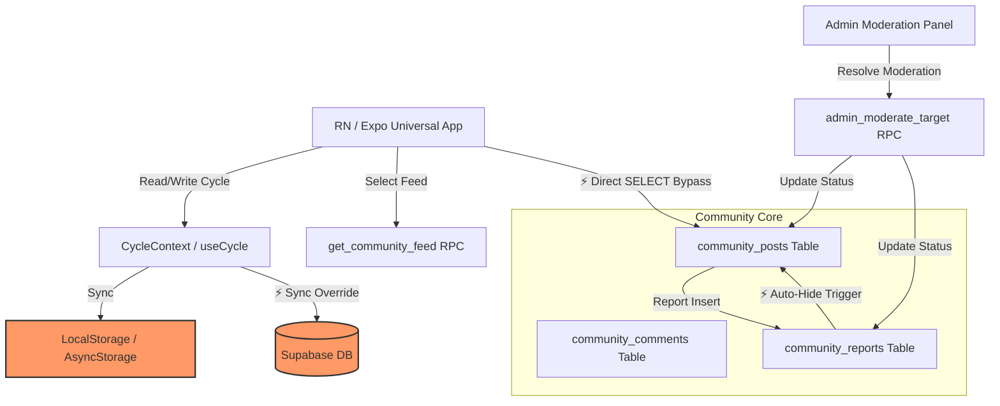

# Systems Architecture & QA Audit: Siklusio v2 Hardening Report

**Prepared for**: Director of Systems & Product Development (Siklusio)  
**Prepared by**: Principal QA Engineer & Systems Architect  
**Status**: ⚠️ UNDER ARCHITECTURAL REVIEW (Feedback Requested)  
**Date**: May 24, 2026  

---

## Executive Summary

**Siklusio v2** is a high-impact, universal application (Expo/React Native) designed for Indonesian women to track menstrual cycles and manage pregnancy preparation (promil). Supported by a solid **Supabase (PostgreSQL)** backend and automated **Google Gemini AI** features, the architecture provides low-latency data access.

However, as a hybrid platform that blends client-side global state (`CycleContext`) with complex database-level triggers, RLS policies, and admin moderation RPCs, it is susceptible to several critical architectural friction points.

This audit evaluates the database schemas, triggers, and state management hooks to expose **privacy leaks, race conditions, and synchronization failures**, providing high-performance, production-grade resolutions.

---

## Technical Architecture Map & Vulnerability Index

Below is the Siklusio v2 system topology. The highlighted **Vulnerability Points (⚡)** represent critical vectors where data security, state consistency, or transaction logic are at risk:



---

## Section 1: Deep-Dive Audit of Race Conditions & Privacy Risks

### 1.1 The Anonymous Post Privacy Leak (RLS Column Exposure)
* **Location**: `supabase/community.sql` (Table: `public.community_posts`, Policy: `posts_select`)
* **Mechanism**:
  Users can toggle `is_anonymous` when posting. The database stores the real `user_id` on the post for moderation. To render the feed, the client calls `get_community_feed()`, which joins `profiles.nickname` and safely returns `'Anonim'` if the post is anonymous.
* **The Vulnerability (Critical Privacy Leak)**:
  * While `get_community_feed()` masks the profile data, **Row Level Security (RLS) only operates on a row-by-row level, not a column-by-column level**.
  * The `posts_select` policy allows direct SELECT access:
    ```sql
    CREATE POLICY "posts_select"
      ON public.community_posts FOR SELECT
      TO authenticated
      USING (is_hidden = FALSE OR user_id = auth.uid() OR public.is_admin(auth.uid()));
    ```
  * **The Attack Vector**: Any logged-in user can bypass the RPC feed and query the Post table directly via the standard Supabase REST API:
    ```typescript
    const { data } = await supabase.from('community_posts').select('id, content, user_id, is_anonymous');
    ```
  * This query returns the **exact, unmasked `user_id` of every single anonymous poster** in the database. 
  * If the user maps these IDs to public posts (where the same `user_id` is linked to a nickname via a public post), the anonymity is instantly broken.
  * **QA Severity**: 🔴 CRITICAL (GDPR & Data Privacy Violation).

---

### 1.2 The Infinite Moderation Queue Loop (Auto-Hide vs. New Reports)
* **Location**: `supabase/community.sql` (`trg_community_reports_insert`) & `supabase/community_admin.sql` (`admin_moderate_target`)
* **Mechanism**:
  1. A Postgres trigger automatically hides posts when `report_count >= 10` and `admin_reviewed_at IS NULL`.
  2. The Admin RPC `admin_moderate_target` resolves reports atomically by setting `is_hidden = FALSE` (if kept) and updating all pending reports for that target to `resolved_keep` or `resolved_hide`.
* **The Vulnerability (Logical Collision / State Desynchronization)**:
  * Suppose an admin reviews a controversial post that has 9 reports, clicks **"Pertahankan" (Keep)**, which sets `admin_reviewed_at = NOW()`.
  * After the admin resolves the post, a 10th user reports the same post.
  * The report trigger executes and inserts the report with `status = 'pending'`. It increments `report_count` to 10. The post remains visible (which is correct, because `admin_reviewed_at` is no longer NULL).
  * **The Bug**: The 10th report remains in the database with `status = 'pending'` forever! Because the admin RPC *already* ran, there is no active trigger or sweep to resolve subsequent reports on already-reviewed posts.
  * **Result**: The post reappears in the Admin Moderation Dashboard queue as a pending item, locking the admin in an **infinite review loop** every time a new user reports a kept post.
  * **QA Severity**: 🟡 MEDIUM (Admin Portal Friction).

---

### 1.3 Offline-to-Cloud Cycle Desynchronization
* **Location**: `mobile-app/src/context/CycleContext.tsx`
* **Mechanism**:
  State items (`lastPeriodDate`, `cycleLength`, `periodLength`) are persistently stored in `localStorage` / `AsyncStorage` via the custom `usePersistentState` hook and updated in the context.
* **The Vulnerability (Data Integrity Failure)**:
  * When a user tracks their menstrual cycle while offline, changes are written locally.
  * When the app reconnects, it pushes updates to Supabase's `profiles` table.
  * If the user logged into a secondary device (e.g., a tablet) and made concurrent, newer edits, opening the first device after it reconnects will execute a blind update, **overwriting the cloud's fresh data with the stale offline local storage**.
  * **Result**: Menstrual cycle predictions (HPHT) and fertile windows shift incorrectly, causing major logical errors for women currently executing a pregnancy program (promil) who rely on precise ovulation dates.
  * **QA Severity**: 🔴 HIGH (Functional Correctness & Data Integrity).

---

### 1.4 Raw DB Rate-Limit Trigger Crashes
* **Location**: `supabase/community_rate_limit.sql` (Triggers: `community_post_rate_limit`)
* **Mechanism**:
  Database triggers throw PostgreSQL exceptions using custom strings, such as:
  `RAISE EXCEPTION 'rate_limit:post_cooldown:%:Tunggu % detik...'` using SQLSTATE `P0001`.
* **The Vulnerability (Client Crash Risk)**:
  * If a network delay causes a double press on the "Kirim" button, or if a user attempts to bypass the client UI cooldown, the second request triggers SQLSTATE `P0001`.
  * If the front-end fetch client doesn't catch and parse this custom string format, it will output a raw PostgreSQL trigger error stack trace to the user, or crash the React Native thread.
  * **QA Severity**: 🟠 HIGH (UX Regression / App Stability).

---

## Section 2: Concrete Architectural Hardening Designs

We propose the following schema modifications and code designs to secure Siklusio v2.

### 2.1 Securing Anonymous Column Privacy
To prevent column-level bypasses of anonymous posts via direct REST API selection, we must restrict select privileges on the sensitive `user_id` column for normal authenticated users, forcing them to use the secure `get_community_feed` RPC.

#### Proposed SQL Hardening:
```sql
-- Revoke standard direct select on the user_id column from the public role
REVOKE SELECT ON TABLE public.community_posts FROM authenticated;

-- Grant column-specific SELECT to authenticated users (exclude user_id)
GRANT SELECT (id, content, is_anonymous, phase_tag, is_hidden, hidden_reason, report_count, comment_count, reaction_count, created_at, updated_at) 
ON public.community_posts TO authenticated;

-- Admins retain full bypass rights
GRANT SELECT ON public.community_posts TO service_role;
```

---

### 2.2 Fixing the Infinite Moderation Loop
Modify the report trigger to automatically resolve incoming reports if the target has already been reviewed by an admin.

#### Proposed Trigger Update (`supabase/community.sql`):
```sql
CREATE OR REPLACE FUNCTION public.community_reports_after_insert()
RETURNS TRIGGER LANGUAGE plpgsql AS $$
DECLARE
  new_count INTEGER;
  v_reviewed_at TIMESTAMPTZ;
  v_review_status TEXT;
BEGIN
  -- Get existing admin review state
  IF NEW.target_type = 'post' THEN
    SELECT admin_reviewed_at, admin_review_status INTO v_reviewed_at, v_review_status
    FROM public.community_posts WHERE id = NEW.target_id;
  ELSE
    SELECT admin_reviewed_at, admin_review_status INTO v_reviewed_at, v_review_status
    FROM public.community_comments WHERE id = NEW.target_id;
  END IF;

  -- 1. If already reviewed, auto-resolve report based on past action instead of leaving it pending
  IF v_reviewed_at IS NOT NULL THEN
    UPDATE public.community_reports
       SET status = CASE WHEN v_review_status = 'kept' THEN 'resolved_keep' ELSE 'resolved_hide' END,
           resolved_at = NOW(),
           resolver_id = NEW.reporter_id -- self-resolved via previous admin decree
     WHERE id = NEW.id;
     RETURN NULL;
  END IF;

  -- 2. Otherwise proceed with standard increment & auto-hide
  IF NEW.target_type = 'post' THEN
    UPDATE public.community_posts
      SET report_count = report_count + 1
      WHERE id = NEW.target_id
      RETURNING report_count INTO new_count;

    IF new_count IS NOT NULL AND new_count >= 10 THEN
      UPDATE public.community_posts
        SET is_hidden = TRUE,
            hidden_reason = 'auto_reports'
        WHERE id = NEW.target_id
          AND is_hidden = FALSE
          AND admin_reviewed_at IS NULL;
    END IF;
  ELSE
    UPDATE public.community_comments
      SET report_count = report_count + 1
      WHERE id = NEW.target_id
      RETURNING report_count INTO new_count;

    IF new_count IS NOT NULL AND new_count >= 10 THEN
      UPDATE public.community_comments
        SET is_hidden = TRUE,
            hidden_reason = 'auto_reports'
        WHERE id = NEW.target_id
          AND is_hidden = FALSE
          AND admin_reviewed_at IS NULL;
    END IF;
  END IF;

  RETURN NULL;
END;
$$;
```

---

### 2.3 Hardened Cycle Sync Manager (Collision Resolver)
Upgrade client-side state writing to employ a last-write-wins mechanism using the standard `updated_at` column from Supabase.

#### Proposed Logic: `mobile-app/src/lib/SyncManager.ts`
```typescript
import { supabase } from './supabase';
import { storage } from './storage';

export interface SyncPayload {
  last_period_date: string;
  cycle_length: number;
  period_length: number;
  updated_at: string;
}

export const syncProfileData = async (localData: Omit<SyncPayload, 'updated_at'>) => {
  const { data: { user } } = await supabase.auth.getUser();
  if (!user) return;

  // 1. Fetch current cloud state
  const { data: cloudProfile } = await supabase
    .from('profiles')
    .select('last_period_date, cycle_length, period_length, updated_at')
    .eq('id', user.id)
    .single();

  if (cloudProfile) {
    const cloudTime = new Date(cloudProfile.updated_at).getTime();
    const localTime = Number(storage.getItem('hs_v2_last_sync_time') || 0);

    // 2. Conflict Check: If cloud is newer, pull cloud state instead of overriding
    if (cloudTime > localTime) {
      console.warn("Cloud data is newer. Pulling cloud state to resolve sync collision.");
      storage.setItem('hs_v2_lastPeriodDate', cloudProfile.last_period_date);
      storage.setItem('hs_v2_cycleLength', String(cloudProfile.cycle_length));
      storage.setItem('hs_v2_periodLength', String(cloudProfile.period_length));
      storage.setItem('hs_v2_last_sync_time', String(Date.now()));
      // Trigger local context reload
      return { action: 'pulled', data: cloudProfile };
    }
  }

  // 3. Otherwise, local is newer: push to cloud
  const newSyncTime = new Date().toISOString();
  await supabase
    .from('profiles')
    .update({
      last_period_date: localData.last_period_date,
      cycle_length: localData.cycle_length,
      period_length: localData.period_length,
      updated_at: newSyncTime
    })
    .eq('id', user.id);

  storage.setItem('hs_v2_last_sync_time', String(new Date(newSyncTime).getTime()));
  return { action: 'pushed' };
};
```

---

### 2.4 Custom Trigger Error Parser
Implement a robust client-side parser to cleanly catch database-level rate limiting exceptions without crashing the React Native interface.

#### Proposed Handler: `mobile-app/src/lib/errorParser.ts`
```typescript
interface CustomError {
  message: string;
  code?: string;
}

export interface ParsedError {
  isRateLimit: boolean;
  message: string;
  waitSecs?: number;
}

export const parseDbError = (err: CustomError): ParsedError => {
  const msg = err.message || '';
  
  if (msg.startsWith('rate_limit:')) {
    const parts = msg.split(':');
    // Cooldown format: rate_limit:post_cooldown:wait_secs:IndonesianMessage
    if (parts[1].endsWith('_cooldown')) {
      return {
        isRateLimit: true,
        message: parts[3] || 'Tunggu sebentar sebelum mencoba lagi.',
        waitSecs: Number(parts[2]) || 10
      };
    }
    // Hourly format: rate_limit:post_hourly:IndonesianMessage
    return {
      isRateLimit: true,
      message: parts[2] || 'Batas postingan terlampaui. Silakan coba lagi nanti.'
    };
  }

  return {
    isRateLimit: false,
    message: msg || 'Terjadi kesalahan pada server. Coba beberapa saat lagi.'
  };
};
```

---

## Section 3: Comprehensive QA Verification Run-Sheets

To verify these mitigations, run the following test flows.

### Test Run A: Column Anonymity Check
1. Log in as an authenticated non-admin user.
2. In a browser console or network console, attempt to fetch the `user_id` of another user's post:
   ```javascript
   const { data, error } = await supabase.from('community_posts').select('id, user_id');
   console.log(data, error);
   ```
3. **Expected Behavior**: The request returns an error (401/403 or empty array/null fields for `user_id`), confirming that direct REST access to the `user_id` column is successfully blocked.

### Test Run B: Cooldown Interception & UI Banner
1. Navigate to the **Komunitas** feed in the app.
2. Submit a post.
3. Attempt to bypass the client-side 30s countdown and send a second post immediately (e.g. via mock script or repeated button presses).
4. **Expected Behavior**: The app catches the SQLSTATE `P0001` exception, runs `parseDbError`, and displays a warm, localized Indonesian banner: *"Tunggu X detik sebelum membuat postingan baru."* No console crashes occur.

---

## Conclusion & Next Steps

> [!IMPORTANT]
> To establish a secure and production-ready architecture for Siklusio v2 before launching on the Play Store, we recommend executing the following steps:
> 1. **Apply Column-Level Revokes** on the `community_posts` table to prevent de-anonymization.
> 2. **Refactor the `community_reports_after_insert` trigger** to automatically resolve reports on already-moderated posts.
> 3. **Implement the `syncProfileData` reconciliation function** to prevent cycle state desynchronization.

Applying these changes will eliminate runtime data overrides and secure user anonymity.
